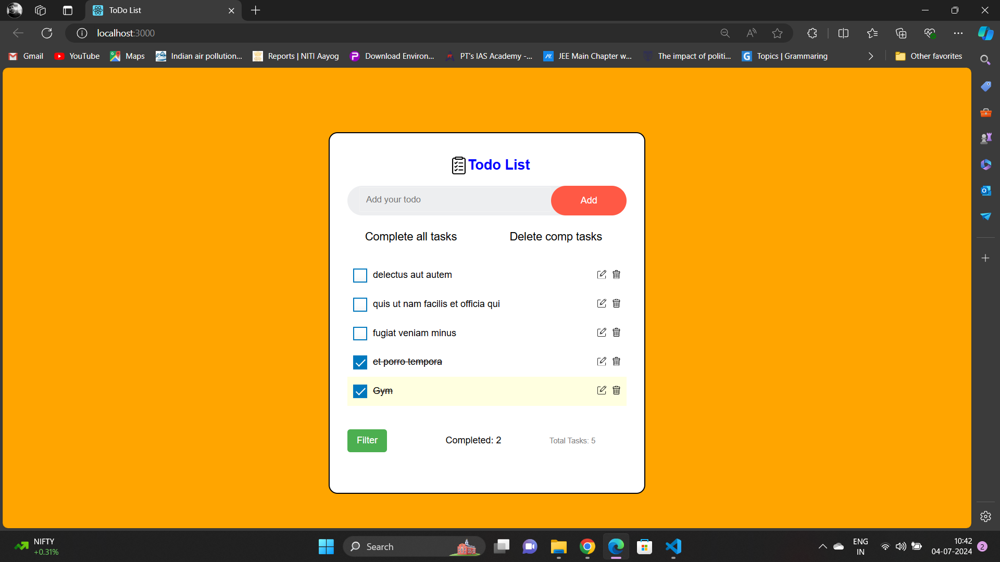
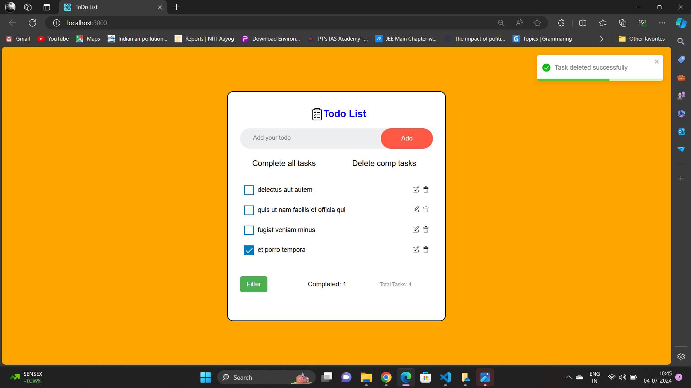
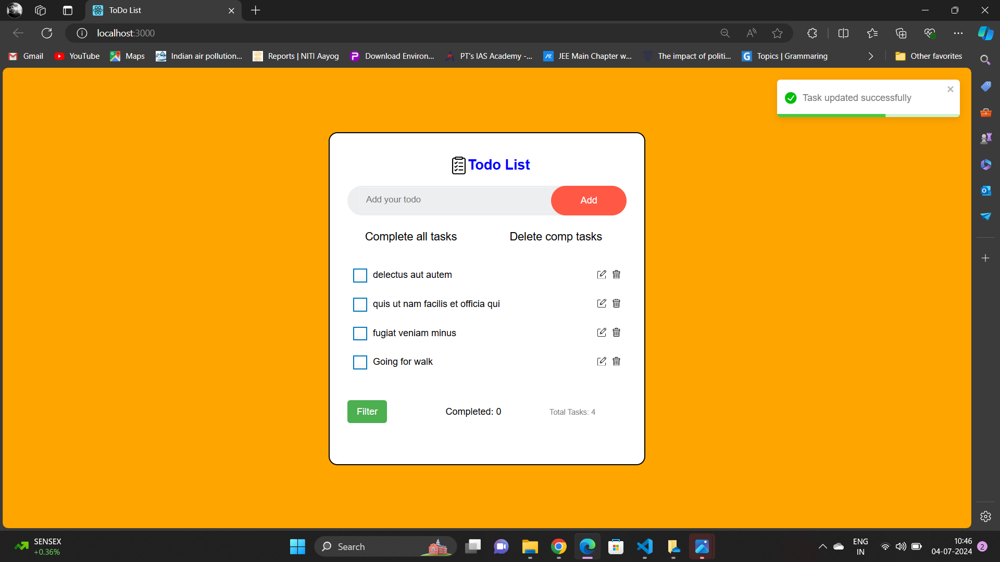
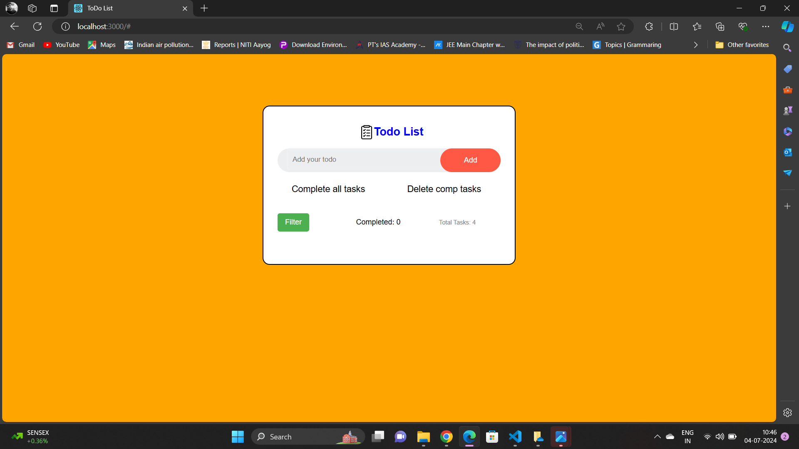
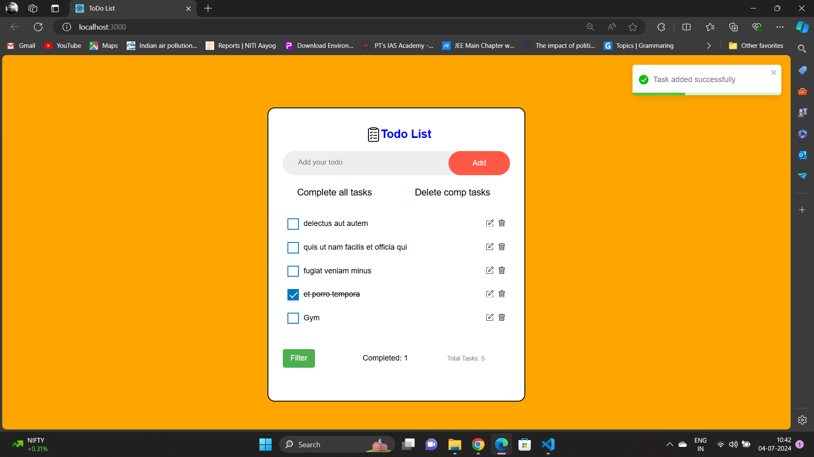

# TodoList App using React

This is a simple TodoList application built using React.

## Features
- Fetch and show todo items from the API: https://jsonplaceholder.typicode.com/todos
- Add a todo item: Make a POST call to the above URL and save the item in React state. This is a dummy request and won't actually add items to the server, but the request is valid and will return some data.
- Update a todo item: Make a PUT call to the above URL. This is a dummy call and won't update items on the server.
- Delete a todo item: Make a DELETE call to the above URL. This is a dummy call and won't delete items from the server.


## Getting Started

These instructions will help you set up and run the project on your local machine for development and testing purposes.

### Prerequisites

Make sure you have the following software installed:

- Node.js
- npm (Node Package Manager)

### Installation


```bash
# Clone the repository:
git clone https://github.com/888Shubham/calculator-using-React.git

# Navigate into the project directory:
cd TodoList-App-uinsg-React

# Install dependencies:
npm install
 Start the development server and view the calculator:
npm start

# Open http://localhost:3000 in your web browser to use the calculator.
# Contributions are welcome. If you'd like to contribute to this project:
# - Fork the repository
# - Create a new branch
# - Submit a pull request
```

## Screenshots






